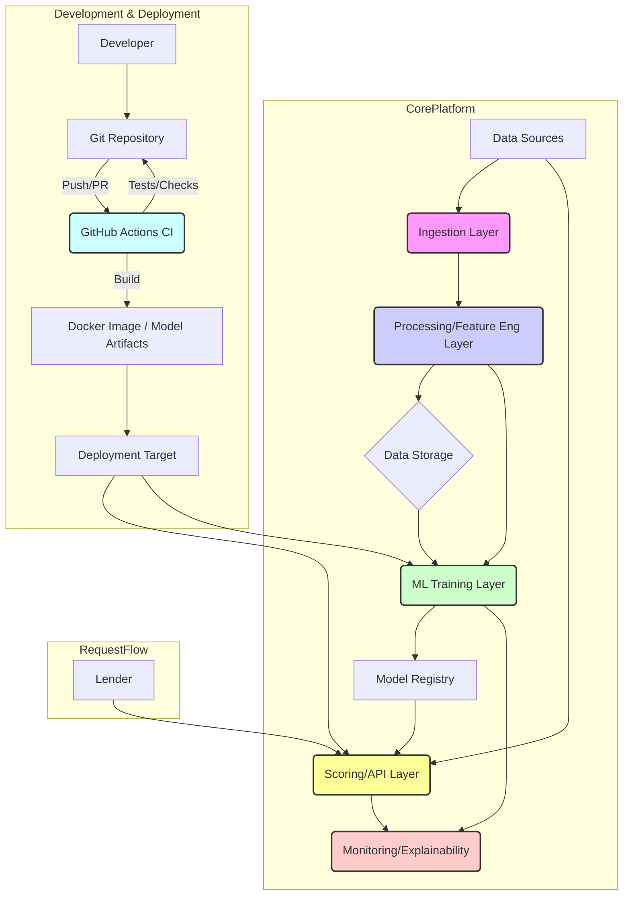

# System Patterns: AI-Based Credit Scoring Platform

## High-Level Architecture (Initial Thoughts)
*   **Data Ingestion Layer:** Responsible for collecting and validating alternative data from various sources (APIs, file uploads, potential partnerships). Needs to be robust and handle different data formats.
*   **Data Processing & Feature Engineering Layer:** Cleans, transforms, and engineers features from the raw alternative data suitable for ML models. May involve data pipelines (e.g., using Apache Spark, Airflow, or cloud-native services).
*   **ML Modeling & Training Layer:** Contains the core credit scoring models. Handles model training, validation, versioning, and potentially A/B testing. Requires infrastructure for ML experimentation and deployment (e.g., MLflow, Kubeflow, SageMaker).
*   **Scoring & API Layer:** Exposes endpoints for lenders to submit borrower identifiers and receive credit scores/risk profiles in real-time or batch. Implemented using FastAPI. Uses Pydantic models (`src/common/models.py`) for request/response validation. Needs to be scalable and secure.
*   **Monitoring & Explainability Layer:** Tracks model performance, data drift, and provides insights into score drivers (important for fairness and regulatory compliance). (Implementation TBD)

## Key Technical Decisions (Initial Choices Made)
*   **Cloud Provider:** Tentatively AWS (needs confirmation if required, proceeding with this assumption).
*   **Primary Programming Language:** Python (confirmed).
*   **Database choices:** PostgreSQL (for structured metadata), S3/Data Lake (for raw/intermediate data). (Initial plan)
*   **ML Frameworks:** TBD (Scikit-learn, Pandas, NumPy included initially).
*   **Data Pipeline Orchestration:** TBD (Airflow/Prefect considered).
*   **API Framework:** FastAPI (confirmed).
*   **CI/CD:** GitHub Actions (CI workflow implemented).
*   **Deployment Strategy:** Docker containers (initial setup). Further strategy TBD (e.g., K8s, ECS, Lambda).
*   **Configuration:** Pydantic Settings + `.env` files.

## Design Patterns (Potential/In Use)
*   Microservices vs. Monolith (depends on scale and team structure).
*   Event-Driven Architecture (for data ingestion/processing).
*   Repository Pattern (for data access).
*   Pipeline Pattern (for data processing and ML workflows).

## Component Relationships (Very High Level)

## Critical Implementation Paths
*   Secure and reliable data ingestion pipelines.
*   Development of accurate and fair ML models tailored to alternative data.
*   Scalable and low-latency scoring API.

*(Refined slightly after initial project scaffolding. Will continue to evolve.)*
